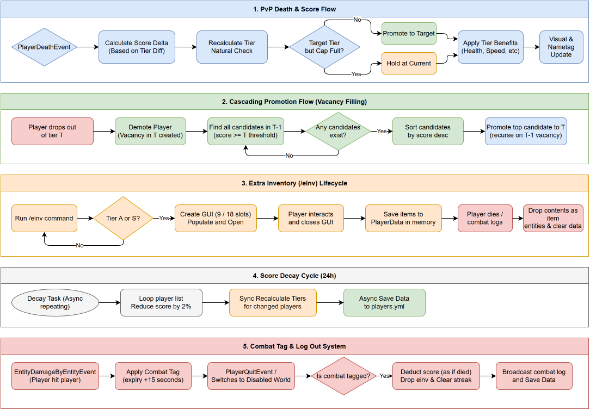

# TierSMP

TierSMP is a Minecraft Paper plugin that creates a competitive tier-based PvP environment. The plugin categorizes players into five distinct tiers based on their PvP kills and score.

## Score and tier thresholds

Players starts as UNRANKED. They change tiers when their score reaches these numbers:
- UNRANKED: 0 to 49 score
- C tier: 50 to 149 score
- B tier: 150 to 299 score
- A tier: 300 to 499 score
- S tier: 500+ score

## Per-tier player caps

To keep competition high, the plugin limits the number of players allowed in each tier at the same time:
- S tier: maximum 3 players
- A tier: maximum 7 players
- B tier: maximum 10 players
- C tier: maximum 10 players

If a tier is full, players who reach the required score will remain in their current tier. When a slot opens up, the plugin automatically promotes the qualifying player with the highest score from the tier below.

## PvP score rules

Kills and deaths change player scores based on tier differences. 
- Killing a higher tier player: +15 score for the killer, -9 score for the victim
- Killing a same tier player: +30 score for the killer, -15 score for the victim
- Killing a lower tier player: +60 score for the killer, -30 score for the victim
- UNRANKED kills are treated as killing a player below C tier (+15 score, -9 score)

### Anti spawn-kill protection
A bidirectional 5-minute cooldown applies after a kill. If Player A kills Player B, neither player can change their score from killing each other for the next 5 minutes. The kill streak still increments, but the score remains unchanged.

### Score decay
Every 24 hours, the plugin reduces every player's score by 2% to prevent players from keeping high tiers while inactive. Tiers are recalculated automatically after decay.

## Combat tagging and logging

Hitting or getting hit by another player triggers a 15-second combat tag. If a player logs off or teleports to a disabled world while tagged, they suffer a score deduction, reset their kill streak to 0, and drop all items in their extra inventory on the ground.

## Tier benefits

Players receive health, experience, and inventory benefits based on their tier:
- **C tier**: 20.0 max health (default). No extra benefits.
- **B tier**: 24.0 max health (+2 hearts) and a 1.1x XP multiplier.
- **A tier**: 28.0 max health (+4 hearts), a 1.25x XP multiplier, a 1.2x potion duration multiplier, and access to a 9-slot extra inventory (`/einv`).
- **S tier**: 32.0 max health (+6 hearts), a 1.4x XP multiplier, a 1.3x potion duration multiplier, permanent Speed I, and access to an 18-slot extra inventory (`/einv`). S tier streaks are also displayed on a sidebar scoreboard.

## Commands

### Player commands
- `/tier [player]` - View your own or another player's tier, score, streak, and leaderboard rank.
- `/tiertop` - View the top ten players by score.
- `/einv` - Open your extra inventory (A and S tiers only).
- `/tierscore give <player> <amount>` - Transfer a portion of your own score to another player.

### Admin commands
Admins require the `tiersmp.admin` permission.
- `/einvsee <player>` - Inspect and edit a player's extra inventory.
- `/tieradmin set <player> <tier>` - Force a player's tier, adjusting their score to the minimum threshold.
- `/tieradmin setscore <player> <amount>` - Set a player's exact score.
- `/tieradmin givescore <player> <amount>` - Add or subtract score.
- `/tieradmin reset <player>` - Reset a player's score, tier, streak, and extra inventory.
- `/tieradmin resetall` - Reset all player data.
- `/tieradmin reload` - Reload config and messages.

## Installation

1. Copy the compiled jar file into your server's `plugins` folder.
2. Restart the server.
3. Edit the generated `config.yml` and `messages.yml` files in the `plugins/TierSMP` directory to customize values.
