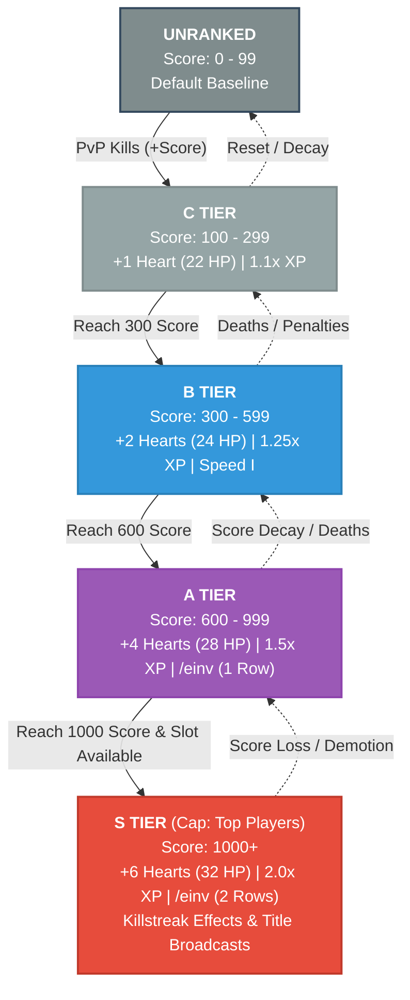
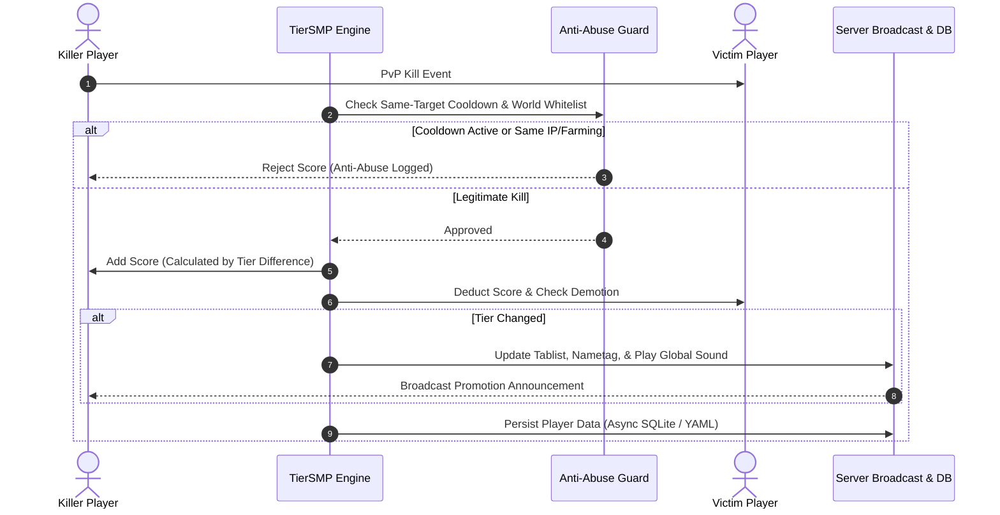
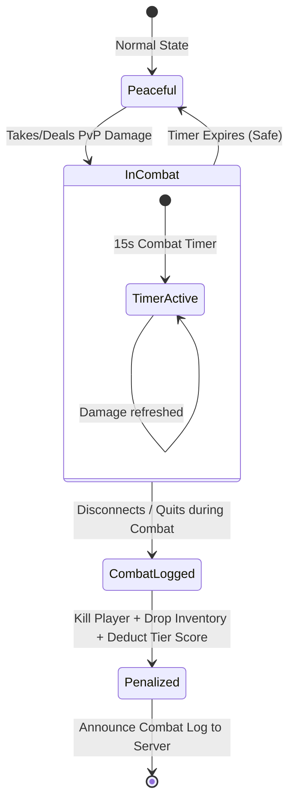

# TierSMP (Free Version)
A lightweight Minecraft Paper plugin (1.21.4+) that adds a competitive tier system (S/A/B/C/UNRANKED) to your SMP server. Players gain score through PvP kills and climb the tier ladder, unlocking health boosts, XP multipliers, potion bonuses, and extra inventory slots.

## Features (Free Version)
- S/A/B/C/UNRANKED tier system with per-tier player caps
- PvP-based score progression with kill cooldown anti-abuse
- Combat log penalty system
- Score decay (all players including offline)
- Extra inventory (/einv) for A and S tier
- Tier nametag colors and particle effects
- Server-wide tier change broadcasts
- Kill streak scoreboard for S tier
- PlaceholderAPI support
- Per-world enable/disable
- Full config and messages customization

## System Flow & Architecture

### 1. Tier Progression Ladder

```mermaid
graph TD
    classDef unranked fill:#7f8c8d,stroke:#34495e,stroke-width:2px,color:#fff;
    classDef cTier fill:#95a5a6,stroke:#7f8c8d,stroke-width:2px,color:#fff;
    classDef bTier fill:#3498db,stroke:#2980b9,stroke-width:2px,color:#fff;
    classDef aTier fill:#9b59b6,stroke:#8e44ad,stroke-width:2px,color:#fff;
    classDef sTier fill:#e74c3c,stroke:#c0392b,stroke-width:2px,color:#fff;

    U["<b>UNRANKED</b><br/>Score: 0 - 99<br/>Default Baseline"]:::unranked
    C["<b>C TIER</b><br/>Score: 100 - 299<br/>+1 Heart (22 HP) | 1.1x XP"]:::cTier
    B["<b>B TIER</b><br/>Score: 300 - 599<br/>+2 Hearts (24 HP) | 1.25x XP | Speed I"]:::bTier
    A["<b>A TIER</b><br/>Score: 600 - 999<br/>+4 Hearts (28 HP) | 1.5x XP | /einv (1 Row)"]:::aTier
    S["<b>S TIER</b> (Cap: Top Players)<br/>Score: 1000+<br/>+6 Hearts (32 HP) | 2.0x XP | /einv (2 Rows)<br/>Killstreak Effects & Title Broadcasts"]:::sTier

    U -->|"PvP Kills (+Score)"| C
    C -->|"Reach 300 Score"| B
    B -->|"Reach 600 Score"| A
    A -->|"Reach 1000 Score & Slot Available"| S

    S -.->|"Score Loss / Demotion"| A
    A -.->|"Score Decay / Deaths"| B
    B -.->|"Deaths / Penalties"| C
    C -.->|"Reset / Decay"| U
```

### 2. PvP Scoring & Anti-Abuse Lifecycle

```mermaid
sequenceDiagram
    autonumber
    actor Killer as Killer Player
    participant Engine as TierSMP Engine
    participant AntiAbuse as Anti-Abuse Guard
    actor Victim as Victim Player
    participant Server as Server Broadcast & DB

    Killer->>Victim: PvP Kill Event
    Engine->>AntiAbuse: Check Same-Target Cooldown & World Whitelist
    alt Cooldown Active or Same IP/Farming
        AntiAbuse-->>Killer: Reject Score (Anti-Abuse Logged)
    else Legitimate Kill
        AntiAbuse-->>Engine: Approved
        Engine->>Killer: Add Score (Calculated by Tier Difference)
        Engine->>Victim: Deduct Score & Check Demotion
        alt Tier Changed
            Engine->>Server: Update Tablist, Nametag, & Play Global Sound
            Server-->>Killer: Broadcast Promotion Announcement
        end
        Engine->>Server: Persist Player Data (Async SQLite / YAML)
    end
```

### 3. Combat Log & Penalty System

```mermaid
stateDiagram-v2
    [*] --> Peaceful: Normal State
    Peaceful --> InCombat: Takes/Deals PvP Damage
    
    state InCombat {
        [*] --> TimerActive: 15s Combat Timer
        TimerActive --> TimerActive: Damage refreshed
    }

    InCombat --> Peaceful: Timer Expires (Safe)
    InCombat --> CombatLogged: Disconnects / Quits during Combat
    
    CombatLogged --> Penalized: Kill Player + Drop Inventory + Deduct Tier Score
    Penalized --> [*]: Announce Combat Log to Server
```

## Premium Version
Premium version available on BuiltByBit (link coming soon).

Premium includes:
- Mixed progression (PvP + achievement milestones)
- Season system with auto-reset and winner announcements
- High-stakes S tier demotion system
- Score transaction between players (/tierscore give)
- Web dashboard (self-hosted, like BlueMap)
- Full admin web panel
- Specialty skill system (coming in v2)

## Installation
1. Download the latest release from GitHub Releases
2. Drop TierSMP-x.x.x-reobf.jar into your plugins/ folder
3. Restart your server
4. Configure plugins/TierSMP/config.yml to your liking

## Compatibility
- Paper / Purpur 1.21.4 up to 26.2+
- Java 21 (for 1.21.x) / Java 25 (for 26.x+)
- Optional: PlaceholderAPI (2.11.x - 2.12.x+)

## Commands
| Command | Description | Permission |
|---------|-------------|------------|
| /tier [player] | View tier info | none |
| /tiertop | View leaderboard | none |
| /einv | Open extra inventory | none (A/S tier only) |
| /tieradmin set <player> <tier> | Force set tier | tiersmp.admin |
| /tieradmin reset <player> | Reset player data | tiersmp.admin |
| /tieradmin resetall | Reset all data | tiersmp.admin |
| /tieradmin reload | Reload config | tiersmp.admin |
| /tieradmin setscore <player> <amount> | Set score | tiersmp.admin |
| /tieradmin givescore <player> <amount> | Give/take score | tiersmp.admin |
| /einvsee <player> | Inspect player einv | tiersmp.admin |

## License
GPL-3.0

<!--
# Development workflow:
# - All free version fixes and features: work on main branch
# - Merge main into premium regularly: git checkout premium && git merge main
# - Premium-only features: develop directly on premium branch
# - Never merge premium into main
-->
